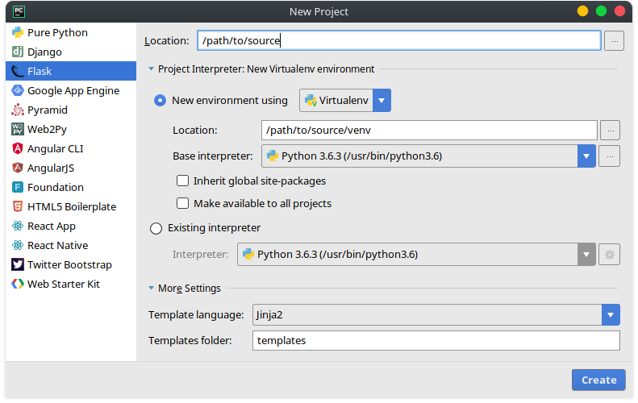

Flask + ReST
============

- [Vorbereitung](#Vorbereitung)
	- [Erweitert](#Erweitert)
		- [Venv](#Venv)
		- [PyCharm](#PyCharm)
- [Struktur](#Vorbereitung)
- [Routen](#Routen)
- [Templates](#Templates)

# Vorbereitung
Die einfachste Variante ein neues [Flask] Projekt aufzusetzen ist die Installation über [pip]. Mit der Methode `flask run` kann die Applikation (App) gestartet werden, auf welche die `FLASK_APP` Umgebungsvariable verweist.
~~~ sh
pip install flask 		# Installiere Flask
export FLASK_APP=app.py 	# Setze die Hauptklasse der App
flask run 			# Starte die App
~~~

## Erweitert
### Venv
Für Projekte wie dieses empfiehlt es sich zu Beginn eine isolierte Arbeitsumgebung aufzusetzen. In Python wird dazu [virtualenv] verwendet.
~~~ sh
pip install virtualenv 		# Installiere Virtualenv
virtualenv venv 		# Erstelle eine neue Umgebung
source venv/bin/activate 	# Aktiviere die Umgebung
~~~
Die Umgebung sollte, sobald die Arbeit beendet ist, über das Kommando `deactivate` wieder deaktiviert werden.

### PyCharm
In PyCharm kann ein neues [Flask] Projekt, mitsamt einer virtuellen Umgebung, einfach über den Reiter `File` → `New Project...` → `Flask` erstellt werden.

# Struktur
Nach der Initialisierung sollte die Ordnerstruktur wie folgt aussehen:
~~~
.
├── static
├── templates
├── venv
└── app.py
~~~

# Routen
Seiten können in [Flask] über die Methode `flask.Flask.route("/path/to/src")` bereitgestellt werden. Versuchen wir uns an einer Willkommensnachricht!

Als erstes müssen unserer `app.py` Datei einige Zeilen hinzugefügt werden. Als Referenz zur App wird die Klasse `flask.Flask` mit dem Namen des aktuellen Pakets als Parameter instanziiert. Anschließend erstellen wir eine Methode `get_index`, welche unsere Willkommensnachricht anzeigen wird.

~~~ python
from flask import Flask

app = Flask(__name__)

@app.route("/")
def get_index():
	return "<h1>Hallo Welt!</h1>"
~~~

Wird die App nun gestartet und die Seite aufgerufen, sollte nun der Text „Hallo Welt!“ angezeigt werden.

# Templates
Bei einer etwas aufwändigeren Seite ist die Rückgabe eines Strings keine gute Option mehr. Zu diesem Zweck sollten bereits vorgefertigte Seiten mit dynamischen Inhalten gefüllt werden. [Flask] bietet dazu die Methode `flask.render_template("path/to/template")`.

Wir erstellen nun eine kleine Unterseite, welche die eingegebene Adresse, zusammen mit einer Überschrift darstellt. Als erstes müssen wir dafür das Template `url.html` definieren:

~~~
<!doctype html>
<html>
<head>
    <title>{{ url }}</title>
</head>
<body>
<h1>Hallo Welt!</h1>

{{ content }}

</body>
</html>
~~~

Die doppelten geschwungenen Klammern (`{{`, `}}`) sind Teil der Template-Engine [Jinja], welche in dieser Anleitung jedoch nur grob angeschnitten wird. Kurzgefasst: Innerhalb dieser Klammern ist es möglich Variablen und Logik Anweisungen zu nutzen. In unserem Fall wird die Variablen `url` erwartet, welche als weiteres Argument der `render_template` Methode übergeben wird.

In unserer `app.py` Datei definieren wir nun unsere neue Route:

~~~ python
@app.route("/<string:url>")
def get_url():
	return render_template("url.html", url=url)
~~~

Beim laden der Seite wird uns nun der Titel „Hallo Welt!“ und die angegebene Adresse angezeigt.

# Author
Markus Reichl <markus@re1.at>

[flask]: http://flask.pocoo.org
[pip]: https://docs.python.org/3/installing/index.html
[virtualenv]: https://virtualenv.pypa.io/en/stable/installation
[jinja]: http://jinja.pocoo.org/