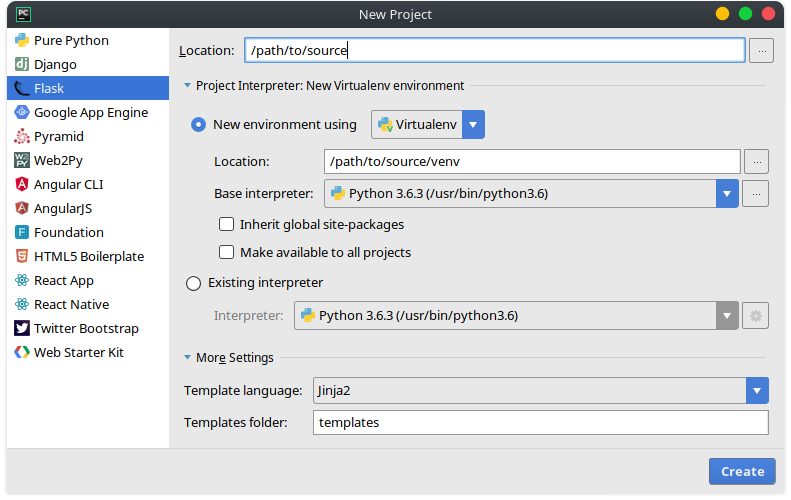

Flask + ReST
============
Markus Reichl <markus@re1.at>

Eine Einführung in das Python Webframework Flask in Python 3.6.

## Vorbereitung
Flask kann einfach über den Python Package Manager pip[1] installiert werden.

~~~ sh
pip install Flask
~~~

### Erweitert
##### Venv
Für Projekte wie dieses empfiehlt es sich zu Beginn eine Virtuelle Arbeitsumgebung zu aufzusetzen. In Python wird zu dazu virtualenv[2] verwendet, welches die Möglichkeit bietet eine Python Umgebung isoliert zu erstellen.
~~~ sh
pip install virtualenv 		# Installiere Virtualenv
virtualenv venv 			# Erstellen
source venv/bin/activate 	# Aktivieren¹
~~~

¹ Die Umgebung sollte, sobald die Arbeit beendet ist, über das Kommando `deactivate` wieder deaktiviert werden.

### Flask
~~~ sh
pip install Flask
~~~

### PyCharm
In PyCharm kann ein neues Flask Projekt einfach über den Reiter `File` → `New Project...` → `Flask` erstellt werden.

~~~
.
|-- app.py
|-- static
|-- templates
`-- venv
~~~

## Referenzen
* [1] Python. Installing Python Modules. https://docs.python.org/3/installing/index.html
* [2] Virtualenv. Installation. https://virtualenv.pypa.io/en/stable/installation
